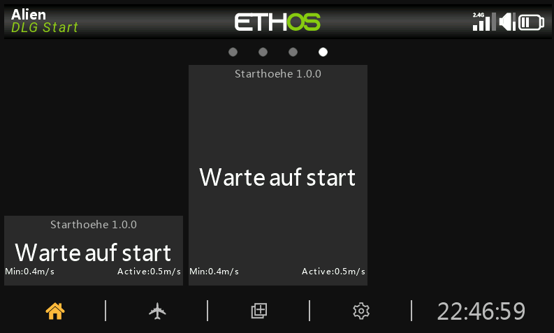
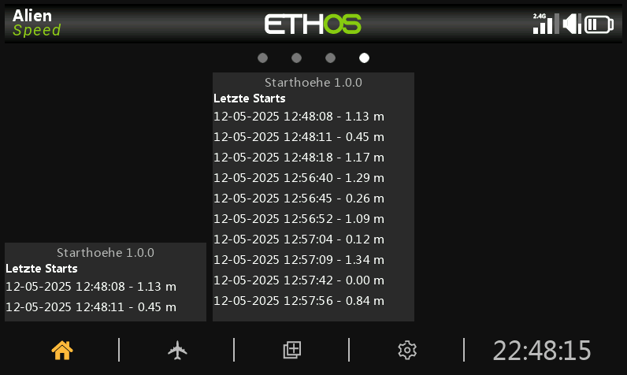
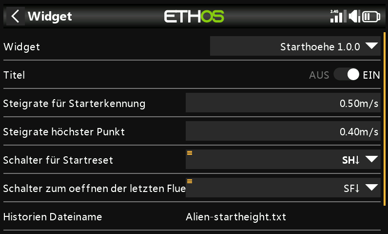

# Ethos Start Height

**Ethos Start Height** is a Lua widget designed for Ethos radios to detect the starting height of activities such as DLG (Disc Launch Gliders) launches or motorized model takeoffs. The widget uses the Vario's climb rate to determine when a launch has occurred and records the maximum height reached during the launch.

---

## Features

### 🚀 **Launch Detection**
- Configurable maximum climb rate to trigger the widget.
- Captures the current height when the climb rate falls below the specified threshold.

### 📝 **Start Height Saving**
- Automatically saves the recorded start height to a file named `modelname-startheight.txt` when the launch is reset.
- The file maintains up to **10 entries**.

### 📜 **History View**
- Displays up to **10 recorded start heights** in a dedicated history view.
- Access the history view via the menu or a configurable switch.

### ⚙️ **Widget Configuration**
- Configure parameters such as:
  - Maximum climb rate
  - Reset switch
  - History switch
- Easily adjustable through the widget configuration menu.

---

## Screenshots

Here are some example views of the widget:

### Main Screen
The main screen displays the current start height.  

### History View
The history view shows the last 10 recorded start heights.  

### Configuration Menu
The configuration menu allows you to set all important parameters.  

---

## Installation and Setup

1. **Download**  
   Clone or download this repository to get the widget files.

2. **Upload**  
   Copy the Lua widget folder (`strt`) to your Ethos radio.
   The widget name is `Startheight/Starthoehe versionnumber`

4. **Configure**  
   Use the Ethos widget configuration menu to:
   - Set the maximum climb rate.
   - Assign a reset switch.
   - Assign a history switch for viewing recorded start heights.

---

## File Storage

The widget saves the start heights to a file named `modelname-startheight.txt`.  
This file is stored on your Ethos radio and contains up to **10 entries**, which you can view in the history page of the widget.

---

## Contributing

Feel free to open issues or submit pull requests to improve this widget. Feedback and contributions are always welcome!

---

## License

This project is licensed under the [MIT License](LICENSE).

---

Happy flying! 🚁🪁
